# Capstone Project-Introduction to Cloud Computing

## Capstone Project: E-Commerce Platform Deployment with Git, Linux, and AWS

**Project Instructions:**

In this project I will be developing an e-commerce website for a new online marketplace named "MarketPeak." This platform will feature product listings, a shopping cart, and user authentication.To implement this project I will use Git for version control, the develpoment platform will be in a Linux environment, and deploy it on an AWS EC2 instance. You can find a suitable website template here to kickstart your development

## Tasks 1: Implement Version Control with Git

**1.1.  Initialize Git Repository:**Create the project directory or folder and name it "MarketPeak_Ecommerce". then cd into the new project directory and ini
it as a git repository.

**Note:**In carrying out the this project, I have the option of using command line terminal of choice, but because I am using windows work station, I will be using **"gitbash"**, this will allow me to run some shell commands on Windows.


**Note:** The above command can be ran one at a time, but I chose to run all at the same time to save time.

## Tasks 2: Get Source code from template.com: 

**2.1. Obtain and Prepare the E-Commerce Website Template**
As a DevOps Engineer, I don't have to develope the website code, that work is for web/software developers. Instead of developing the website from scratch, I will use a pre- existing e-commerce website template. 

**Download a Website Template:** Visit (Tooplate)[https://www.tooplate.com/] or any other free template resource, and download a suitable e-commerce website template. Look for templates that are ready to use and require minimal adjustments.
It is recommended you download the specific template

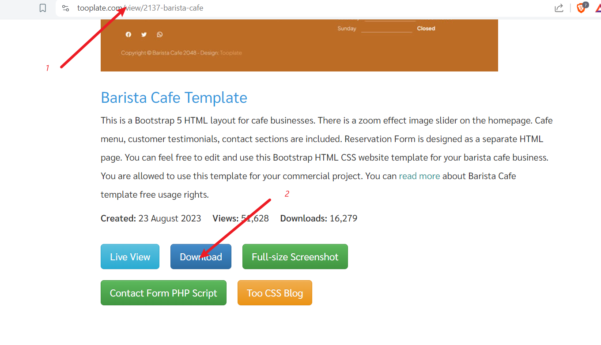

**Prepare the Website Template:** Extract the downloaded template into your project directory, MarketPeak_Ecommerce.

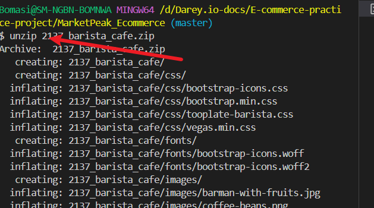

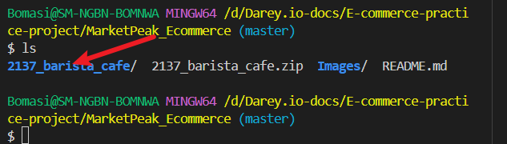

**Note:**I can equally unzip with windows GUI, but I used CLI because it was faster for me.

## Tasks 3: Stage and Commit the Template to Git: Carrry out the following actions respectively

* Add your website files to the Git repository.

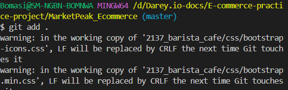

* Set your Git global configuration with your username and email.

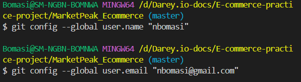

* Commit your changes with a clear, descriptive message.

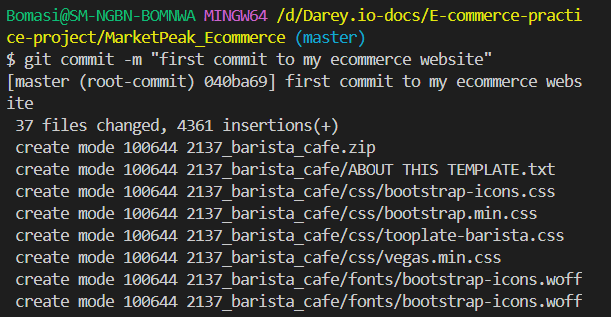

**Task 4:  Push the code to your Github repository**

All git activities done far were done for the repository to be trac  by git on our local workstation.

What happen if our system is currupted by virus or our workstation totally breakdown, that means we will lost all of our files and start all over again. That is never the best practice. To avoid this we will carry out the following steps:

*** Create a Remote Repository on GitHub:** Log into your GitHub account and create a new repository named "MarketPeak_Ecommerce" Leave the repository empty without initializing it with a README, .gitignore, or license.

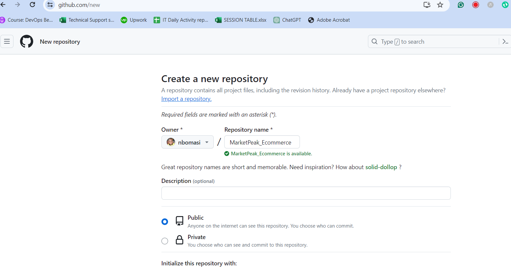

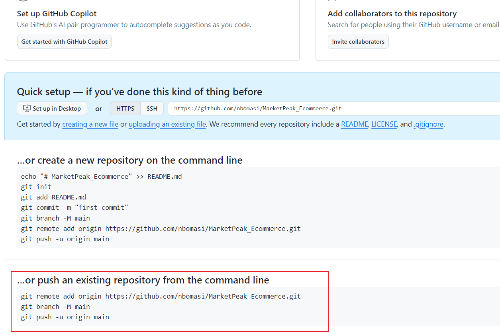

*** Link Your Local Repository to GitHub:** In your terminal, within your project directory, add the remote repository URL to your local repository configuration.

```markdown
git remote add origin https://github.com/nbomasi/MarketPeak_Ecommerce.git
```

*** Push your code to GitHub repository:** Push using the following command:

```markdown
git push -u origin main
```
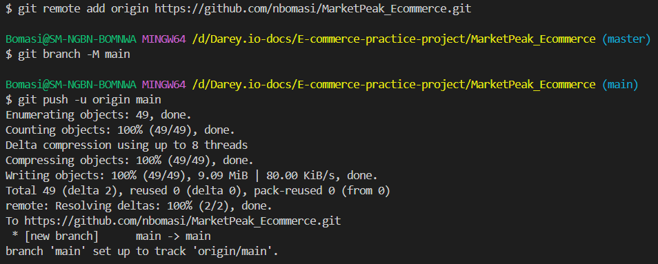


## AWS Deployment

**2.1. Set Up an AWS EC2 Instance**

* Log in to the AWS Management Console.
* Launch an EC2 instance using an Amazon Linux AMI.
* Connect to the instance using SSH.
* Note that I used my existing security group that has both port 22 and port 80 opened. I also used existing keypair

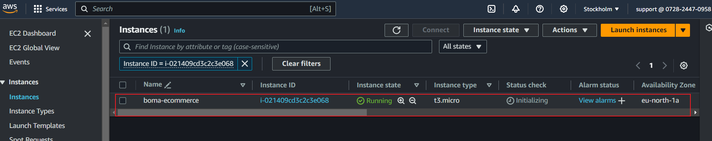

**2.2. Clone the repository on the Linux Server**
Before deploying your e-commerce platform, you need to clone the GitHub repository to your AWS EC2 instance. This process involves authenticating with GitHub and choosing between two primary methods of cloning a repository: SSH and HTTPS. 

**Authenticating with GitHub using ssh**

* On your EC2 instance, generate SSH keypair using ssh-keygen as shown:

```markdown
ssh-keygen
```
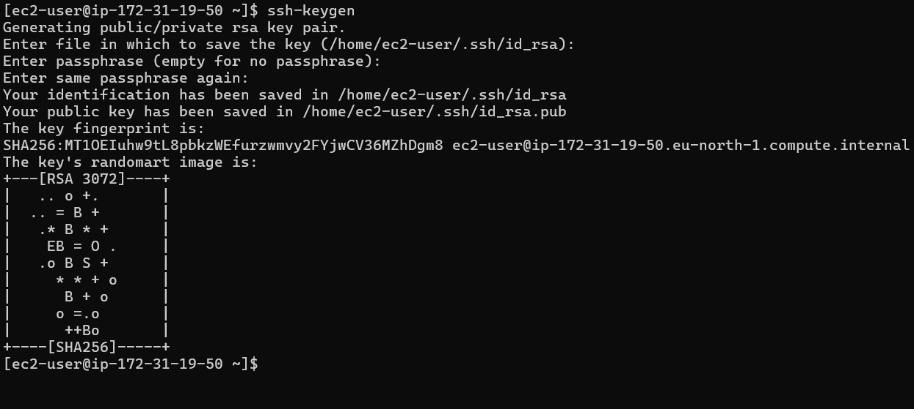

*** cat and copy the public key.**

```markdown
cat /home/ec2-user/.ssh/id_rsa.pub
```

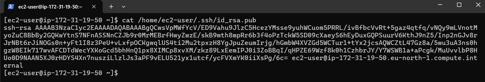

*** Adding ssh public key to GitHub repository**:

Click on your **image icon**, click on **settings**, then click on click on **ssh and Gkeys**

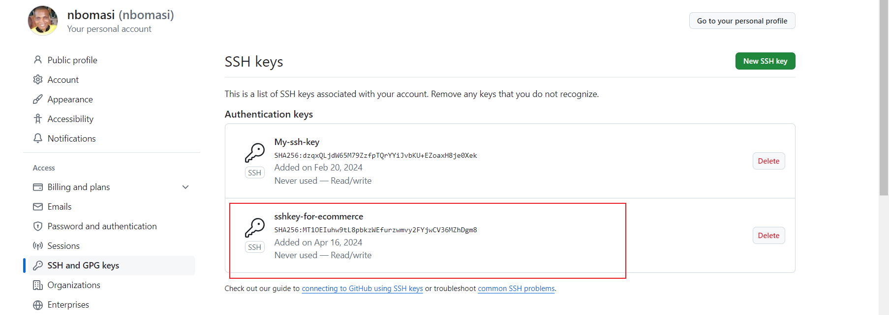

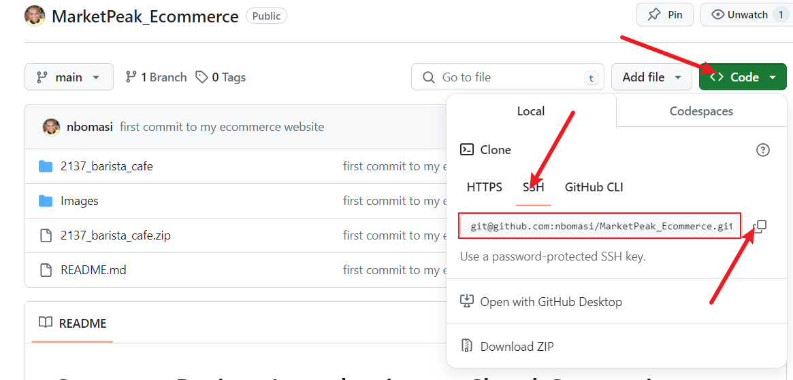

```markdown
git clone git@github.com:nbomasi/MarketPeak_Ecommerce.git
```

**Authenticating with GitHub using HTTPS**

For repositories that you plan to clone without setting up SSH keys, use the HTTPS URL. GitHub will prompt for your username and password:

Note that github.com no longer accept password, but you will have to generate **tokens**

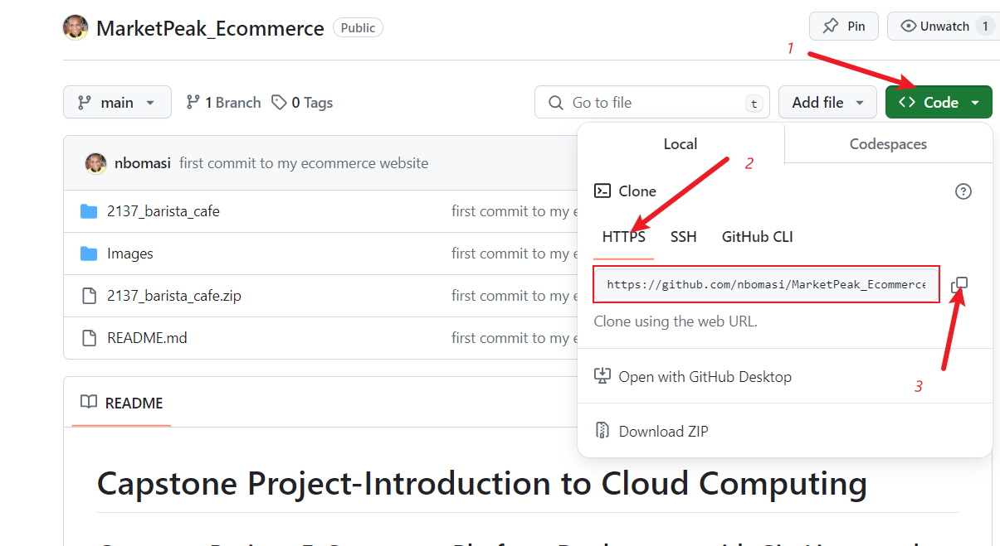

```markdown
git clone https://github.com/nbomasi/MarketPeak_Ecommerce.git
```
**Note:** With AWS redhat, git is not preinistalled so I have to install it manually, using the following command:

```markdown
sudo yum install git -y
```

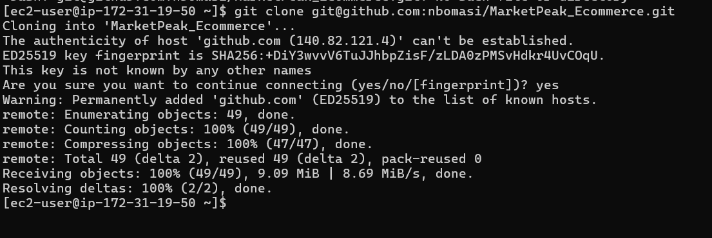

## Installing a Web Server on EC2

**Apache HTTP Server (httpd)** is a widely used web server that serves HTML files and content over the internet. Installing it on Linux EC2 server allows you to host M**arketPeak E-commerce** site:

* Install Apache web server on the EC2 instance. Note that httpd is the software name for Apache on redhats systems using yum package
manager

* I will use the following command to install Apache:

```markdown
sudo yum update -y
sudo yum install httpd -y
sudo systemctl start httpd
sudo systemctl enable httpd
```

**Configure httpd for Website**:

**Prepare the Web Directory:** Clear the default httpd web directory and copy MarketPeak Ecommerce website files to it.

```markdown
sudo rm -rf /var/www/html/*  # Delete the default

sudo cp -r ~/MarketPeak_Ecommerce/2137_barista_cafe/* /var/www/html/ # copy the content of MarketPeak_Ecommerce cloned earlier
```

**Reload httpd:** Apply the changes by reloading the httpd service.

```markdown
sudo systemctl reload httpd
```

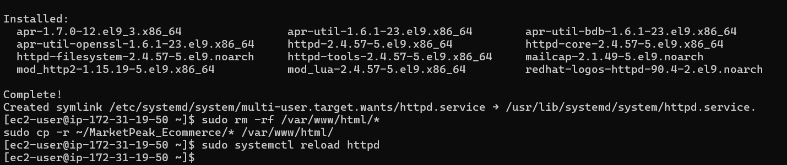

## Access Website from Browser
With httpd configured and website files in place, MarketPeak Ecommerce platform is now live on the internet:
Open a web browser and access the public IP (http://13.60.9.161/) of your EC2 instance to view the deployed website.

**Note:** that HTTP port 80 must be opened in AWS security group.

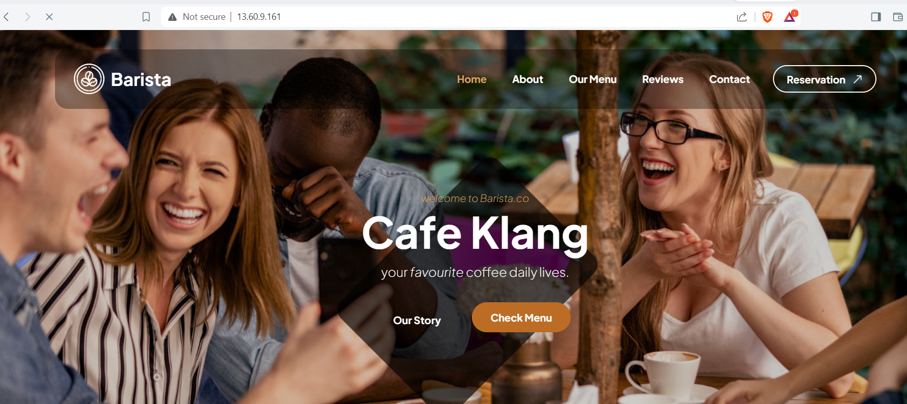


## 3. Continuous Integration and Deployment Workflow

To ensure a smooth workflow for developing, testing, and deploying my e-commerce platform, follow this structured approach. It covers making changes in a development environment, utilizing version control with Git, and deploying updates to your production server on AWS.

**Step 1:** **Developing New Features and Fixes**

* **Create a Development Branch:** Begin your development work by creating a separate branch. This isolates new features and bug fixes from the stable version of your website.

```markdown
git branch development
git checkout development
```
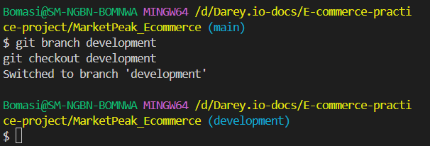

**Implement Changes:** On the development branch, add your new features or bug fixes. This might include updating web pages, in my case, I just changed the **slide image**

**step 2:****Version control with Git**
Run the following git command to stage, commit, and push to development branch:

```markdown
git add .

git commit -m "Add new features or fix bugs"

git push origin development
```
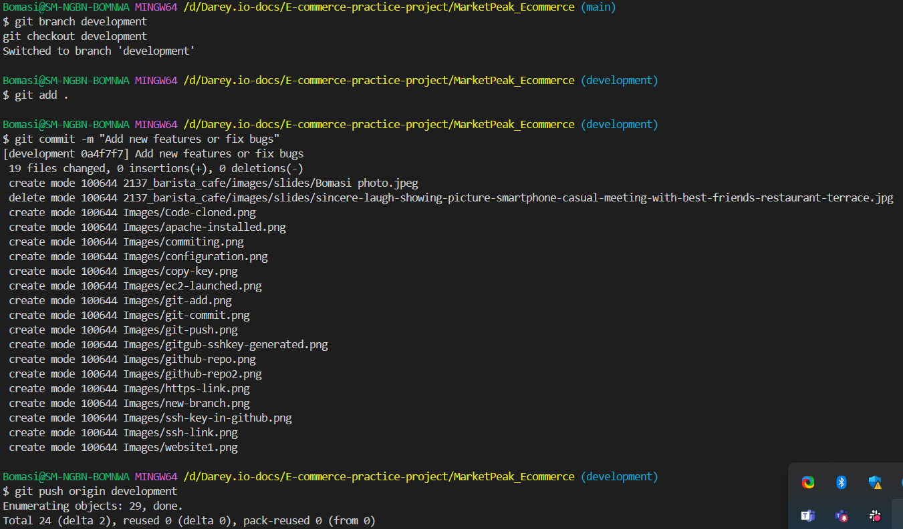


**Step 3: Pull Requests and Merging to the Main branch**
**Create a Pull Request (PR):** On GitHub, create a pull request to merge the development branch into the main branch. This process is crucial for code review and maintaining code quality.

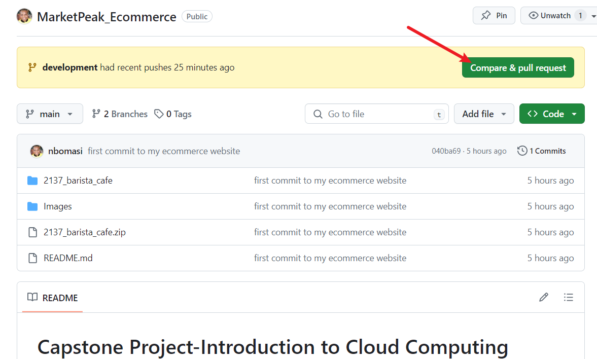

**Review and Merge the PR:** Review the changes for any potential issues. Once satisfied, merge the pull request into the main branch, incorporating the new features or fixes into the production codebase.

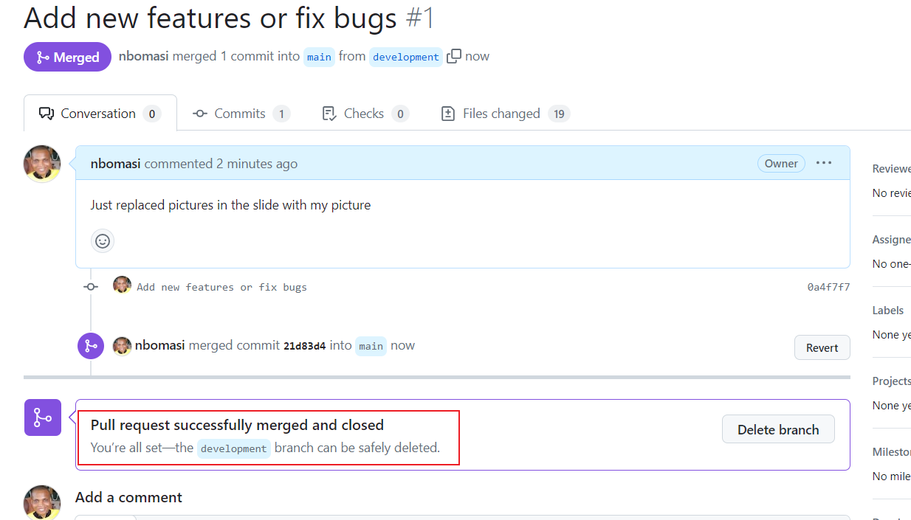

```markdown
git checkout main
git merge development
```

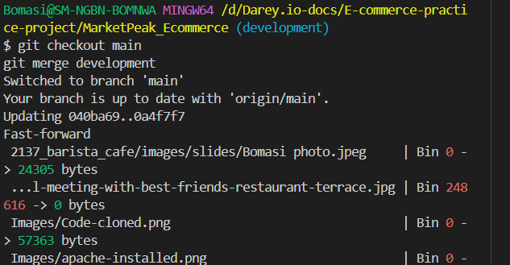

**Push the Merged Changes to GitHub:** Ensure that your local main branch, now containing the updates, is pushed to the remote repository on GitHub.

```markdown
git pull

git push origin main
```
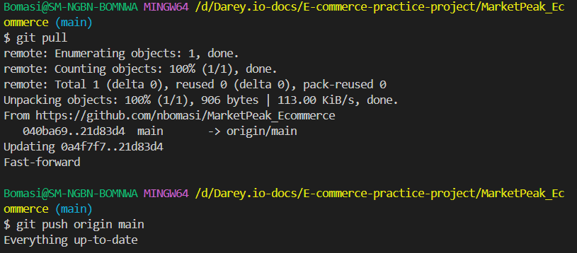


**Step 4: Deploying Updates to the Production Server**

**Pull the Latest Changes on the Server:** SSH into your AWS EC2 instance where the production website is hosted. Navigate to the website's directory and pull the latest changes from the main branch.

```markdown
git pull origin main
```

**Restart the Web Server (if necessary):** Depending on the nature of the updates, you may need to restart the web server to apply the changes.

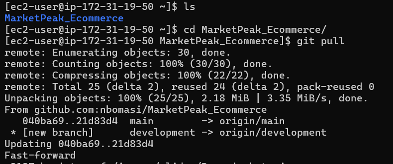

```markdown
sudo rm -rf /var/www/html/*
sudo cp -r ~/MarketPeak_Ecommerce/2137_barista_cafe/* /var/www/html/
```


```markdown
sudo systemctl reload httpd
```


## Step 5: Testing the New Changes

**Access the Website:** Open a web browser and navigate to the public IP address of your EC2 instance. Test the new features or fixes to ensure they work as expected in the live environment.

This workflow emphasizes best practices in software development and deployment, including branch management, code review through pull requests, and continuous integration/deployment strategies. By following these steps, you maintain a stable and up-to-date production environment for your e-commerce platform.

http://13.60.9.161/

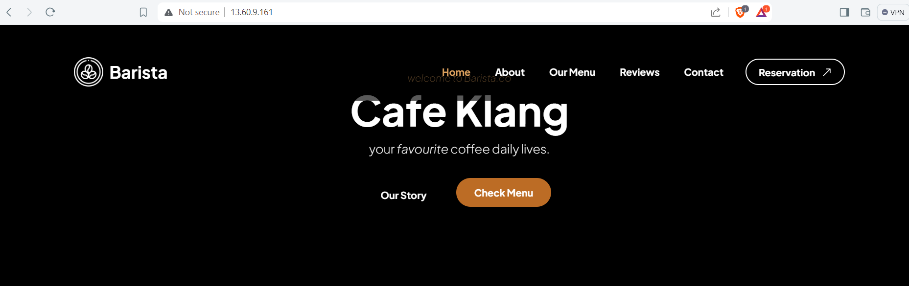


