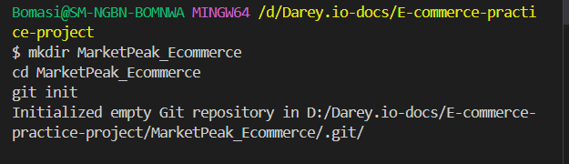

# Capstone Project-Introduction to Cloud Computing

## Capstone Project: E-Commerce Platform Deployment with Git, Linux, and AWS

**Project Instructions:**

In this project I will be developing an e-commerce website for a new online marketplace named "MarketPeak." This platform will feature product listings, a shopping cart, and user authentication.To implement this project I will use Git for version control, the develpoment platform will be in a Linux environment, and deploy it on an AWS EC2 instance. You can find a suitable website template here to kickstart your development

## Tasks 1: Implement Version Control with Git

**1.1.  Initialize Git Repository:**Create the project directory or folder and name it "MarketPeak_Ecommerce". then cd into the new project directory and ini
it as a git repository.

**Note:**In carrying out the this project, I have the option of using command line terminal of choice, but because I am using windows work station, I will be using **"gitbash"**, this will allow me to run some shell commands on Windows.

**Note:** The above command can be ran one at a time, but I chose to run all at the same time to save time.

## Tasks 1: Implement Version Control with Git: 

**1.2. Obtain and Prepare the E-Commerce Website Template**
As a DevOps Engineer, I don't have to develope the website code, that work is for web/software developers. Instead of developing the website from scratch, I will use a pre- existing e-commerce website template. 
**Download a Website Template:** Visit (Tooplate)[https://www.tooplate.com/] or any other free template resource, and download a suitable e-commerce website template. Look for templates that are ready to use and require minimal adjustments.
It is recommended you download the specific template

**Prepare the Website Template:** Extract the downloaded template into your project directory, MarketPeak_Ecommerce.

